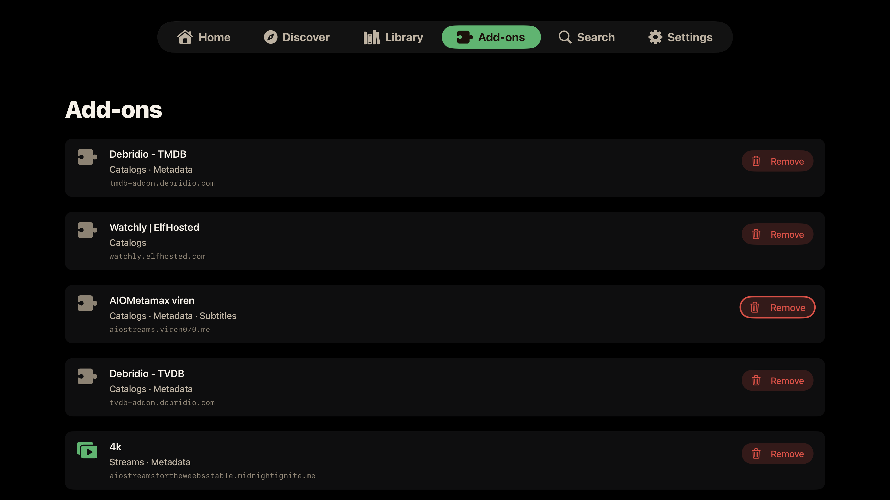

<p align="center">
  <picture>
    <source media="(prefers-color-scheme: dark)" srcset="docs/logo-dark.png">
    
  </picture>
</p>

# StremioX

Stremio for iPhone, iPad, and Apple TV. An independent, actively updated client for Apple devices, with a fully native Apple TV app built on stremio-core.

## Why this exists

Apple pulled Stremio from the App Store, and Stremio's answer was to go the sideload route: in February 2026 they released sideloadable IPAs for iPhone, iPad, and Apple TV (the v1.3.6 build most people are still running). For a long stretch after that those Apple builds sat untouched while Android, Windows, and the web kept getting features, and the download links quietly disappeared from the site. A newer iPhone build has since appeared, but on **Apple TV** the official option remains "Stremio Lite," which is deliberately feature limited, so Apple TV users in particular are still stuck.

That is the gap StremioX closes. It is a native Apple TV client built on stremio-core (the same Rust engine the official apps use), with an iPhone and iPad build alongside it. It is not a replacement for the official apps, it is not affiliated with anyone, and it takes nothing away. It is just a way for Apple users, and Apple TV users especially, to stop waiting.

One thing worth being straight about: I didn't hand-write the code. Claude (Anthropic's AI) wrote all of it. My part was the direction and the grind. I ran every build on my own Apple TV, signed into my own account, kept finding the parts that were broken or felt off, and sent it back to redo until it was genuinely good enough to use every day. So this is "an AI wrote it and a real person beat it into shape," not a one-shot generated repo. A small but growing group of community contributors has since pitched in too (see Credits).

## Two builds: Full and Direct

The Apple TV release ships in two flavors. Pick one; they are the same app otherwise, and your account, profiles, and settings are identical between them.

| | **StremioX (Full)** | **StremioX Direct** |
|---|---|---|
| File | `StremioX-tvOS-x.y.z.ipa` (~48 MB) | `StremioX-tvOS-direct-x.y.z.ipa` (~31 MB) |
| Torrents and magnets | Yes, via the embedded streaming server | No, cannot play them at all |
| Embedded streaming server | Bundled and running | Not bundled |
| Direct and debrid links (Real-Debrid, TorBox, Premiumize, usenet resolved to http) | Yes | Yes |
| Best for | Everyone who wants torrent support | Debrid-only users who never want a peer connection without a VPN |

**Why a Direct build exists.** When you play a torrent your device joins a peer-to-peer swarm, and your IP is visible to everyone in it. Debrid and direct links are ordinary HTTPS downloads with none of that exposure. If you only ever stream through a debrid service, the Direct build removes the torrent engine entirely, so there is no way to accidentally start a peer connection, and the app is smaller and starts faster.

**You do not need the Direct build to get this safety.** The Full build has a **Direct Links Only** switch in Settings that hides every torrent and magnet source and keeps the engine off. The Direct build is simply that choice made permanent, for people who would rather the capability not be present at all.

## What it looks like (Apple TV)

Home, with your real Continue Watching and every catalog from your add-ons. The background is alive: whichever title you focus fills the screen with its artwork and details, and rows fade out underneath as you browse deeper. The focused card carries a soft glow in your accent color, so it is always clear where you are.


Series pages open ready to play. A Resume or Play button on the hero jumps to the right episode, an **Add to Library** chip saves it for later, and the episode list sits below with watched ticks, progress stripes, and per-season and whole-series bulk controls under a long press or the `...` menu.


Episode pages get the full-bleed cinematic treatment: the still owns the screen with the air date, runtime, rating, and synopsis over it, and Watch Now ranks every source as your add-ons answer. The full ranked list ("All sources") and a two-level Quality picker are one button away.


In the player, a Playback panel holds speed control, a live playback-info overlay, and a **stream link as a QR code** you can scan with your phone to keep watching there. The player switches the Apple TV into real HDR and Dolby Vision modes, skips intros and credits, recovers from stalls on its own, and lets you jump to another source without leaving.


Discover and Library, with proper type, catalog, genre, and sort filters, and the same living backdrop.


Profiles, free. Each one has its own look, its own watch history, an optional PIN, and optionally its own account. A "Who's watching?" picker greets you at launch when more than one exists.


Settings: profiles, account, the playback mode (Direct Links Only), the embedded streaming server with a one-press Restart, appearance, and player preferences in one place.


Add-ons you have installed are listed and removable right in the app.



## What you get

**Apple TV.** There is no WebKit on tvOS, so this is a fully native SwiftUI app running on stremio-core, the same Rust engine the official apps use, compiled straight in. Because the real engine does the work, your catalogs, library, and Continue Watching come out right instead of being stitched together by hand. The player is native libmpv (MPVKit-GPL); torrents stream through the embedded server.

**iPhone and iPad.** The current iOS build hosts Stremio's live web interface in a WKWebView and plays through the same native libmpv player so codecs and HDR work, with the streaming server running through nodejs-mobile for torrents and a "Play in" hand-off to external players. Because it follows the live web, a web update can occasionally disrupt it; a fully native iPhone and iPad client on stremio-core, like the Apple TV app, is the next major piece of work on the roadmap.

Everything the Apple TV app does today:

**Browsing**

- Home with your real Continue Watching and every catalog from every installed add-on, built by the official engine so they match the official apps.
- A living backdrop on Home, Discover, and Library: whichever title you focus fills the screen with its real backdrop art, year, rating, runtime, genres, and synopsis, with rows tucking away underneath as you browse deeper.
- A theme-colored focus glow on every poster across Home, Discover, and Library, so the focused card reads at a glance from across the room.
- Full-bleed movie and episode pages: the artwork owns the screen, details sit over it, episode pages show the still, air date, runtime, rating, and synopsis.
- Series pages open ready to play: a Resume or Play button on the hero jumps to the right episode (in progress, or first unwatched), and the episode list opens on that season. Contributed by [OrigamiSpace](https://github.com/OrigamiSpace).
- Partly watched episodes show a progress stripe; watched episodes show a tick. Per-season and whole-series watched and unwatched controls live in a long-press menu on the season chips and in a visible `...` menu.
- **Add to Library / Watch Later**: an Add to Library chip on every movie and series page saves a title for later, reflecting the engine's own saved state so it stays correct everywhere.
- Discover with type, catalog, and genre filters; Library with type and sort filters; search across your add-ons; add-on management built in.
- Long-press menus on posters everywhere: dismiss from Continue Watching or open its full **Details** page, add to or remove from the library, mark watched or unwatched by episode, season, or series. Finished titles leave Continue Watching on their own.

**Continue Watching that just plays**

- Click a Continue Watching card and it resumes the exact stream you were on, at the exact position, straight into the player, with no detour through the detail page.
- A **Details** option in the long-press menu opens the full page when you do want to pick a different episode or quality.
- The exact link is remembered per profile; expired debrid links fall into the player's retry screen.

**Sources**

- Watch Now: every source from every add-on is ranked (cached and direct first, then resolution, remux, HDR) and one press plays the best. The button stays greyed with a live add-on counter until your sources finish answering, so it always plays the best of everything, not the best of whatever loaded first.
- A two-level Quality picker: choose the tier (4K, 1080p, 720p, Others), then the flavor inside it (Dolby Vision, DTS-HD, BluRay, Atmos, WEB and the rest), each labeled with its file size, duplicates collapsed.
- The full ranked list shows the real detail per source: resolution, remux or BluRay or WEB, DV or HDR, Atmos or DTS-HD, codec, cached, and file size, with the top few per add-on so one add-on returning hundreds can't bury the rest.
- Real-Debrid sources rank last and only play when nothing else exists, since the service purged its cache and throttles.
- **Torrents work.** They stream through the embedded server, which is given the patience a cold swarm needs (with a live peer count and speed under the spinner), and every torrent announces over TCP/TLS trackers as well as the usual ones, so swarms form reliably. Debrid and direct URLs play straight.
- **Play a link**: from Search, paste a direct video URL, a magnet, a bare host, or a debrid or usenet link your service resolved to http(s), and it plays.

**Playback**

- The codecs actually work: TrueHD and Atmos, DTS-HD MA, EAC3, 4K, HDR, and Dolby Vision all play through libmpv, instead of silence or a black screen.
- Real HDR and Dolby Vision output: starting HDR content switches the Apple TV's HDMI link into the content's mode at its native frame rate, your TV lights its HDR or Dolby Vision badge, and the display returns to normal when playback ends. Requires Match Dynamic Range under Settings > Video and Audio > Match Content on the Apple TV.
- A **Dolby Vision / HDR compatibility** toggle for the rare displays where a Dolby Vision Profile 7 remux comes out green or purple: it tone-maps HDR and Dolby Vision down to clean SDR. Off by default.
- A half-gigabyte read-ahead buffer sized to what the Apple TV can actually hold, so 4K remuxes ride out network dips without stalling.
- **Seamless binge**: the next episode is fetched and ranked in the background at the halfway mark, its source is woken up just before the credits so there is no provider cold start, and it locks to the same release group the current stream advertised, so episode two never jumps quality or edition mid-binge.
- **Per-series quality memory**: Watch Now remembers, per series and per profile, the quality you last played and opens in it again. Cached and instant sources still win.
- **Stall recovery**: if the picture freezes while it is not buffering, the player reloads the stream in place at your position; if a source keeps stalling, you land on the source list instead of a dead screen. You can also switch to another source mid-playback, and a failed stream offers the source list in one press.
- **Stream link QR**: the Playback panel shows the playing stream as a QR code (a magnet for torrents), to scan with your phone and keep watching there.
- Playback speed control, a live playback-info overlay (resolution, codec, hardware decode, FPS, dropped frames, buffer), skip intro / recap / credits (crowd-sourced timestamps merged with the file's chapter markers, with sanity guards), smart audio and subtitle selection from your preferred languages, language-grouped track pickers, subtitle styling and sync, bundled fonts for every script, a seekable scrubber with accelerating hold-to-seek, fit / zoom / stretch aspect modes, and resume across sessions.
- Live progress flows back to your account while you watch, so Continue Watching is correct on every device, and the watched marker flips automatically near the end.

**Profiles**

- A "Who's watching?" picker at launch when more than one profile exists, with no flash of the wrong profile's Home before it.
- Each profile keeps its own name, avatar, accent theme, and background; switching re-themes the whole app instantly.
- Each profile keeps its OWN watch history: its own Continue Watching, resume positions, and watched markers, invisible to the others.
- An optional 4-digit PIN gates any profile, stored as a salted hash so it can be changed but never read back.
- A profile can share the main account or sign into its own; switching keeps every session valid.
- Sign in by scanning a QR code with your phone instead of typing a password with the remote; password sign-in stays as a fallback. Contributed by [OrigamiSpace](https://github.com/OrigamiSpace).
- Profiles and their history are per-device for now; cross-device sync returns once StremioX has its own sync channel, planned on the roadmap.

**The rest**

- Eight accent themes plus a true-black OLED mode; the whole app, including the focused tab, repaints live when you switch.
- Direct Links Only toggle to hide torrents and keep the engine off (the Direct build makes this permanent).
- A one-press Restart in Settings, since Apple TV has no force quit, to bring the embedded server back if it ever needs it.
- An in-app update notice that checks for new releases and tells you when one is out.
- A branded launch splash that honors Reduce Motion, a screen that stays awake during playback and sleeps when paused, and the option to point at your own streaming server.

## Installing

The builds are attached to the [latest release](../../releases/latest). They are unsigned because this is a third-party client distributed outside the App Store, so you re-sign them yourself with one of the methods below. None require a jailbreak.

Grab the IPA you need from the latest release. For Apple TV, decide between the **Full** build (`StremioX-tvOS-x.y.z.ipa`, torrents included) and the smaller **Direct** build (`StremioX-tvOS-direct-x.y.z.ipa`, debrid and direct links only); see "Two builds" above. The iOS IPA covers iPhone and iPad.

### The trade-off to understand first

Apple only runs apps signed by a valid identity, and what you sign with decides how long the install lasts:

- **A free Apple ID** signs for **7 days** at a time, then the app stops opening until you re-sign it (your settings and sign-in survive, it is just the signature that expires).
- **A paid Apple Developer account** ($99/year) signs for **1 year**.
- **A signing service** (Signulous, and similar) uses its own developer identity to give you 1-year installs without owning a developer account, for roughly $20/year per device.

### Method 1: Signulous (easiest, what I use, works for all three devices)

1. Go to [signulous.com](https://www.signulous.com), buy a device registration, and follow their steps to register your iPhone, iPad, or Apple TV (for Apple TV they walk you through finding its UDID).
2. Wait for the registration to be processed (usually under an hour, can take a few).
3. Open their upload page, upload the StremioX IPA, and it appears in your personal library.
4. On the device, open the install link they give you and install. On Apple TV, installation happens over the browser flow they provide.
5. Signed for a year. When a new version ships, upload the new IPA and install over the top; your sign-in and settings stay.

### Method 2: Sideloadly (free, iPhone, iPad, and Apple TV)

1. Download [Sideloadly](https://sideloadly.io) on your Mac or Windows PC and install it.
2. iPhone or iPad: connect over USB (or enable Wi-Fi sync in Finder/iTunes first and do it wirelessly).
3. Apple TV: make sure it is on the same network. In Sideloadly it appears as a network device. On newer tvOS you may need to pair first: on the Apple TV go to Settings, then Remotes and Devices, then Remote App and Devices, and keep that screen open while Sideloadly connects.
4. Drag the IPA into Sideloadly, enter your Apple ID (a throwaway is fine and keeps your main account clean), and press Start.
5. First time only, on iPhone and iPad: Settings, then General, then VPN and Device Management, tap your Apple ID, and tap Trust.
6. With a free Apple ID the app runs for 7 days; re-run Sideloadly to re-sign, nothing inside is lost. A paid developer account runs for a year.

### Method 3: AltStore or SideStore (free, iPhone and iPad only, auto re-sign)

1. Install [AltStore](https://altstore.io) (needs AltServer on a computer on your network) or [SideStore](https://sidestore.io) (after setup, no computer needed).
2. Add the IPA through the app (in AltStore: My Apps, the plus button, pick the IPA).
3. These re-sign automatically in the background, so the 7-day limit takes care of itself as long as the device sees AltServer once a week (AltStore) or periodically (SideStore).
4. Neither supports Apple TV.

### Method 4: Xcode (free, for developers, all devices)

1. On a Mac with Xcode, open Window, then Devices and Simulators. Connect iPhone or iPad over USB; pair the Apple TV over the network (it shows under Discovered and displays a pairing code).
2. Drag the IPA onto the device, or re-sign with your personal team first using [ios-app-signer](https://dantheman827.github.io/ios-app-signer/) if Xcode refuses the unsigned IPA.
3. Free Apple ID signs for 7 days, paid developer account for a year.

### Updating

Install the new version's IPA over the old one with the same method and the same Apple ID; your sign-in, profiles, and settings carry over. If you switch signing identities, iOS treats it as a different app and you start fresh. You can move between the Full and Direct builds the same way.

## Security and privacy

Reasonable questions for any unsigned build, so here is the straight version:

- It is unsigned on purpose. You re-sign it with your own identity, so nothing here runs under my signature.
- What the Apple TV app talks to: the official account API (api.strem.io) to sign in and sync, the add-ons you have installed, and whichever streaming server you point it at. Nothing else. No analytics, no telemetry, no third-party trackers.
- Your account token is kept in the device Keychain, not in plain preferences, and only ever goes to the official API.
- Each release lists SHA-256 checksums next to the assets, and a verified `-ci` build, compiled from source on GitHub's runners, is attached so you can confirm the published binary really comes from this code.
- You do not have to take my word for any of it. The full source is here, and you can build the IPA yourself.

## It comes with nothing

You sign in with your own account and bring your own add-ons. No content is bundled and no add-ons are bundled. What you watch, and whether it is legal where you live, is on you.

## Building it yourself

You'll need macOS with Xcode, [XcodeGen](https://github.com/yonaskolb/XcodeGen), Node and pnpm (for the iOS web bundle), and Rust nightly with rust-src (for the tvOS engine). MPVKit comes in over Swift Package Manager. No local Stremio install is needed: the fetch script downloads everything it cannot find.

```bash
# 1) Streaming-server deps: NodeMobile (tvOS-enabled build from this repo's vendor
#    release), server.js (from a local Stremio.app if present, otherwise the
#    public CDN), and the bundled subtitle fallback fonts.
./scripts/fetch-server-deps.sh

# 2) iOS only: build the stremio-web bundle
./scripts/build-web.sh

# 3) tvOS only: build the stremio-core engine into an xcframework (needs Rust nightly + rust-src)
./scripts/build-core-xcframework.sh

# 4) Generate the project and build (unsigned, for sideloading)
cd app && xcodegen generate
# Full Apple TV build (with torrents):
xcodebuild -scheme StremioXTV       -sdk appletvos -destination 'generic/platform=tvOS' -configuration Release CODE_SIGNING_ALLOWED=NO build
# Direct Apple TV build (no embedded server):
xcodebuild -scheme StremioXTVDirect -sdk appletvos -destination 'generic/platform=tvOS' -configuration Release CODE_SIGNING_ALLOWED=NO build
# iOS build:
xcodebuild -scheme StremioX         -sdk iphoneos  -destination 'generic/platform=iOS'  -configuration Release CODE_SIGNING_ALLOWED=NO build

# 5) Wrap the built .app into an .ipa
./scripts/repackage-ipa.sh <dir-with-Payload> build/StremioX.ipa
```

`server.js` is not committed here because it is the streaming server's own proprietary file. The script prefers a copy from a local Stremio.app (set `STREMIO_APP` to point at one) and otherwise downloads the standard desktop build from the public CDN, so a fresh clone builds without any local install.

## How the tvOS app works

It started out talking to add-ons by hand, and that kept getting small things wrong, so it was moved onto stremio-core, the open-source Rust engine. The engine is built as a static library, packaged as StremioXCore.xcframework, and talks to Swift as plain JSON over a C interface (see the `core/` folder). The SwiftUI screens send the engine actions and render whatever state it hands back, which is why the behavior lines up with the official app: it is the same engine. There's more in `docs/REBASE-stremio-core.md`.

## What's next

The plan for upcoming work (the native iPhone and iPad client on the engine, offline downloads, our own streaming server with Usenet and live TV, richer per-profile add-on sets, and more) is in [ROADMAP.md](ROADMAP.md).

## Known issues

- **Profiles are per-device for now.** The roster and each profile's watch history live on the device. An early build (0.2.7 to 0.2.9 build 30) tried to sync them through the account's library storage; that could break library sync in official apps with a "Serialization error: state.watched" message. Current builds scrub those documents from the account automatically on launch, which fixes the official apps too. If you saw that error, open StremioX once on this version and give the official app a minute to resync.
- **iPhone and iPad follow the live web.** The iOS app hosts the live web interface, so a web update can occasionally disrupt it. The native iOS client on the roadmap removes this dependency.
- **Unsigned builds.** You re-sign the IPA yourself, and depending on the signing method, reinstalling can require signing in again.

## Not affiliated

This is an independent community project. It is not affiliated with or endorsed by Stremio, Anthropic, or Apple. All names and trademarks belong to their owners.

## Credits

- [Stremio](https://www.stremio.com/), for stremio-core, the streaming server, and the apps this picks up from.
- [mpv](https://mpv.io/) and [MPVKit](https://github.com/mpvkit/MPVKit), for the player.
- [nodejs-mobile](https://github.com/nodejs-mobile/nodejs-mobile), for the embedded server runtime.
- Claude (Anthropic) wrote the code.
- [OrigamiSpace](https://github.com/OrigamiSpace), the first and most prolific community contributor: QR sign-in, live search, the Resume/Play hero and watched-state controls, the tab bar and focus fixes on real hardware, verified CI release builds, the Direct Links Only mode and the StremioX Direct build, and the build-from-source report that made a fresh clone work for everyone.

See [THIRD-PARTY-NOTICES.md](THIRD-PARTY-NOTICES.md) for the full list.

## A note on the bundled streaming server

The Full IPAs include `server.js`, the streaming server's own proprietary file, distributed for free inside the official apps. StremioX has not modified it and claims no rights to it; it is bundled only so the app works out of the box. The Direct build omits it entirely. Swapping it for an open-source streaming server is on the [roadmap](ROADMAP.md).

## Star History

<a href="https://www.star-history.com/?repos=mamaclapper%2FStremioX&type=date&legend=top-left">
 <picture>
   <source media="(prefers-color-scheme: dark)" srcset="https://api.star-history.com/chart?repos=mamaclapper/StremioX&type=date&theme=dark&legend=top-left" />
   <source media="(prefers-color-scheme: light)" srcset="https://api.star-history.com/chart?repos=mamaclapper/StremioX&type=date&legend=top-left" />
   
 </picture>
</a>

## License

[GPL-3.0](LICENSE), because the app links MPVKit-GPL. The streaming server's own components come from Stremio and remain under their own terms; this repository does not include them, they are fetched at build time.
