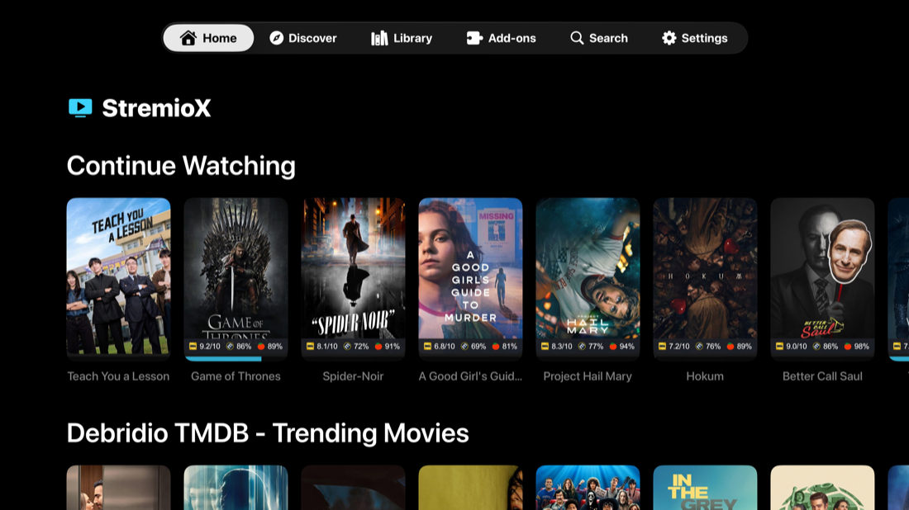
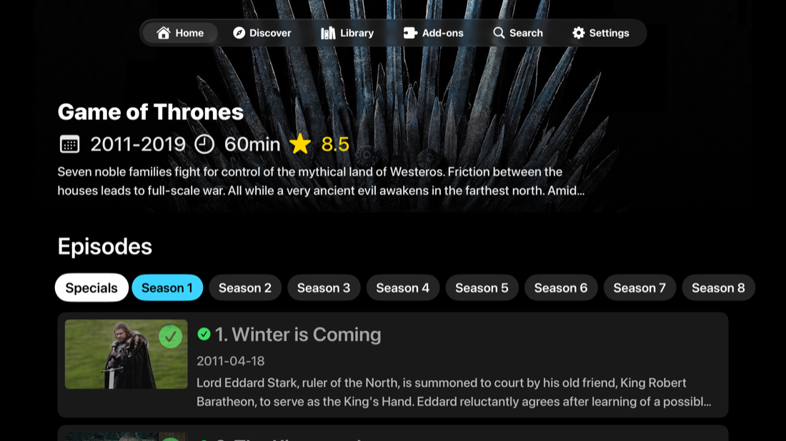
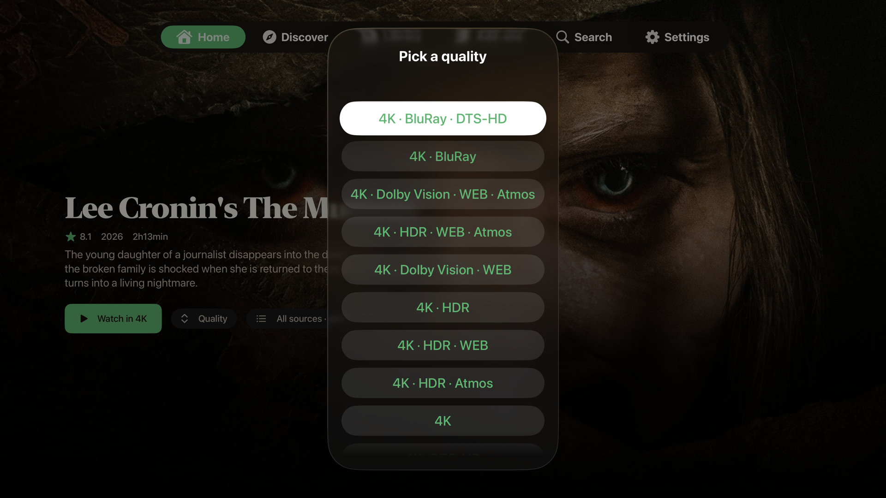
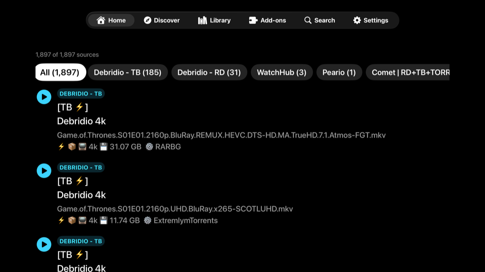
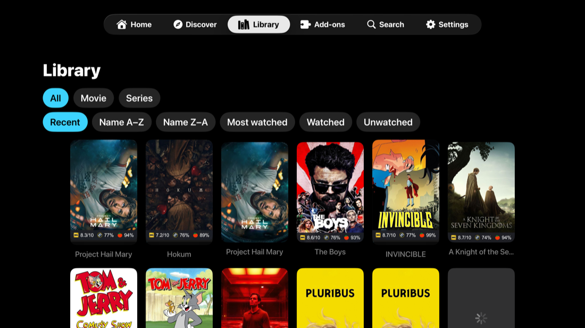
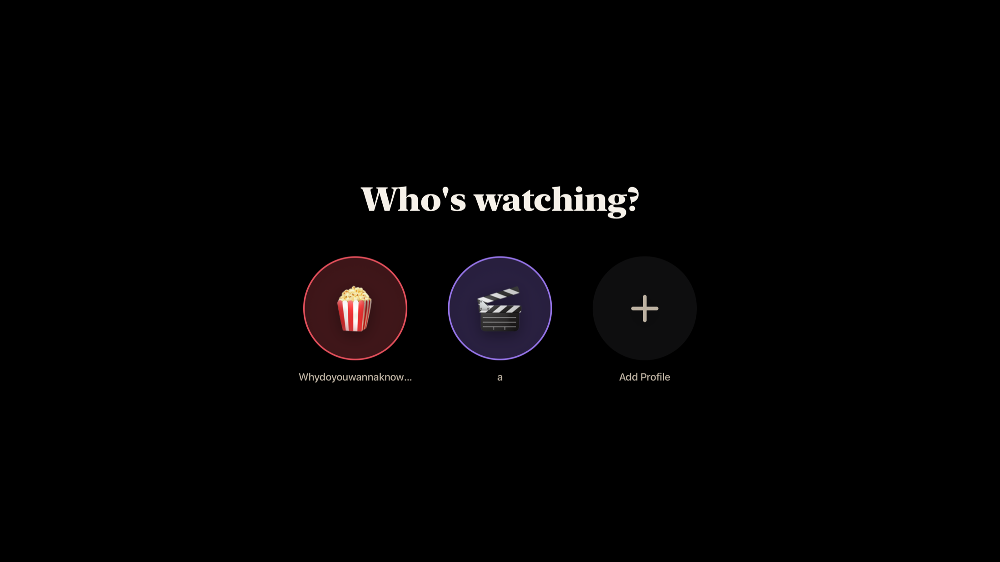
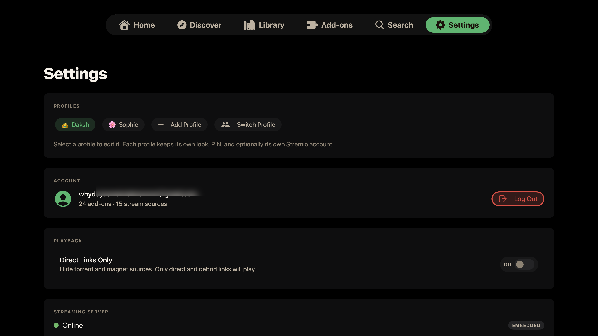

# StremioX

Stremio for iPhone, iPad, and Apple TV. An independent, updated client for Apple devices, with a native Apple TV app built on stremio-core.

## Why this exists

Apple pulled Stremio from the App Store, and Stremio's answer was to go the sideload route. In February 2026 they released fully featured sideloadable IPAs for iPhone, iPad, and Apple TV, said they were waiting to hear back from Apple about returning to the store, and hinted at more coming in 2026. That February build (v1.3.6) is almost certainly the one most of us are running.

The catch is what happened after. Those Apple builds have not been updated in months, the download links quietly went missing from the site, and meanwhile the Android, Windows, and web apps kept getting features and fixes. On Apple TV the official option is "Stremio Lite," which is deliberately feature limited. So Apple users, and Apple TV users in particular, are stuck on something stale while everyone else moves on.

That is the gap I wanted to close. StremioX is an independent, updated client, built fresh for Apple TV on stremio-core (the same engine Stremio uses) and for iPhone and iPad. It is not a replacement for Stremio, it is not affiliated with them, and it takes nothing away from their apps. It is just a way for Apple users to stop waiting.

One thing I want to be straight about. I didn't write the code. Claude (Anthropic's AI) wrote all of it. My part was the direction and the grind. I ran every build on my own devices, signed into my own account, kept finding the parts that were broken or felt off, and sent it back to redo until it was actually good enough to use every day. So this is "an AI wrote it and a real person beat it into shape," not a one-shot generated repo.

If it keeps even a handful of Apple users on Stremio, that was the whole point.

## What it looks like (Apple TV)

Home, with your real Continue Watching and every catalog from your addons. The background is alive: whichever title you focus fills the screen with its artwork and details, and rows fade out underneath it as you browse deeper:



Movie pages are full-bleed: the artwork owns the whole screen, and one press on Watch plays the best source your addons returned (the full ranked list is one button away):



Or pick the exact flavor you want. The Quality button lists the best source per resolution and variant, Dolby Vision, DTS-HD, BluRay, Atmos and the rest:



Episode pages get the same cinematic treatment, with the episode still, air date, runtime, rating, and synopsis over it:



Skip intro and outro: the player knows where the intro is (crowd-sourced timestamps merged with the file's chapter markers) and one press skips it:


Discover and Library, with proper type, catalog, genre, and sort filters:




Profiles, the feature Stremio put behind its paywall, free. Each profile has its own look, its own watch history, an optional PIN, and optionally its own Stremio account:



Settings: profiles, account, the embedded streaming server, appearance, and player preferences in one place:



## What you get

**iPhone and iPad.** It hosts Stremio's live web interface in a WKWebView and plays the stream in a native libmpv player (MPVKit-GPL) so codecs and HDR actually work. It also runs Stremio's streaming server through nodejs-mobile for torrents. There's a "Play in" hand-off to Infuse or VLC. Because it follows the live web, a Stremio web update can occasionally disrupt it; a native iPhone and iPad client on stremio-core, like the Apple TV app, is in progress and will remove that dependency.

**Apple TV.** There's no WebKit on tvOS, so this one is a fully native SwiftUI app. The part I'm proud of is that it runs on stremio-core, the same Rust engine the official apps use, compiled straight into the app. Because the real engine does the work, your catalogs, library, and Continue Watching come out right instead of being stitched together by hand. Same native libmpv player, same embedded server.

Everything the Apple TV app does today:

**Browsing**

- Home with your real Continue Watching and every catalog from every installed add-on, matching the official app, because the official engine builds them.
- A living backdrop on Home, Discover, and Library: whichever title you focus fills the screen with its real backdrop art, year, rating, runtime, genres, and synopsis, on every row and every grid, with rows tucking away underneath as you browse deeper.
- Full-bleed movie and episode pages: the artwork owns the screen, the details sit over it, episode pages show the still, air date, runtime, rating, and synopsis.
- Discover with type, catalog, and genre filters; Library with type and sort filters; search across your add-ons; add-on management built in.
- Long-press menus on posters everywhere: dismiss from Continue Watching, add to or remove from the library, mark watched or unwatched, by episode, season, or series. Finished titles leave Continue Watching on their own.

**Profiles**

- A "Who's watching?" picker at launch when more than one profile exists.
- Each profile keeps its own name, avatar, accent theme, and background; switching re-themes the whole app instantly.
- Each profile keeps its OWN watch history: its own Continue Watching, resume positions, and watched markers, invisible to the other profiles.
- Profiles and their history are per-device for now. Stremio's API offers no safe place for third-party data (the one approach that technically worked corrupted library sync for official apps, so it was removed and is automatically repaired). Cross-device profile sync returns once StremioX has its own sync channel, planned on the roadmap.
- An optional 4-digit PIN gates any profile.
- A profile can share the main Stremio account or sign into its own; switching keeps every session valid.

**Sources**

- Watch Now: every source from every add-on is ranked (cached and direct first, then resolution, remux, HDR) and one press plays the best. The button stays greyed with a live add-on counter until your sources finish answering, so it always plays the best of everything, not the best of whatever loaded first.
- A two-level Quality picker: choose the tier (4K, 1080p, 720p, Others), then the flavor inside it (Dolby Vision, DTS-HD, BluRay, Atmos, WEB and the rest), with duplicates collapsed.
- Real-Debrid sources rank last and only play when nothing else exists, since the service purged its cache and throttles.
- The full ranked per-add-on list is one button away, with per-add-on filtering, and survives titles that return thousands of sources.
- Torrents stream through the embedded server; debrid and direct URLs play straight.

**Playback**

- The codecs actually work: TrueHD and Atmos, DTS-HD MA, EAC3, 4K, HDR, and Dolby Vision all play through libmpv, instead of silence or a black screen.
- A deep read-ahead buffer (a gigabyte of forward cache on Apple TV) so even huge 4K remuxes ride out network dips without stalling.
- Skip intro, recap, and credits: crowd-sourced timestamps (looked up by IMDB, TMDB, or TVDB id, so every catalog add-on works) merged with the file's own chapter markers, with sanity guards so a bad entry can never skip you into the middle of an episode. Cached on device.
- Auto-play next episode, properly: the next episode is fetched and ranked in the background at the halfway mark, so when the credits end the best source is already chosen and starts instantly.
- Smart track selection: audio and subtitles picked from your preferred languages automatically, with forced-subtitle handling.
- Language-grouped audio and subtitle pickers, subtitle styling (size, color, background), subtitle and audio sync adjustment, and bundled fonts for every script (CJK, Arabic, Hebrew, Thai, Devanagari and more).
- A seekable scrubber with accelerating hold-to-seek, jump to start, fit / zoom / stretch aspect modes, previous / next and a direct episode list for series, and resume across sessions.
- The player recovers on its own when a stream hiccups (bounded auto-retry with a reconnecting indicator), and you can switch to a different source mid-playback without losing your position.
- Leaving the player puts you back on the exact page playback started from.
- Live progress flows back to your account while you watch, so Continue Watching is correct on every device, and the watched marker flips automatically near the end.

**The rest**

- Eight accent themes plus a true-black OLED mode; the whole app, including the focused tab, repaints live when you switch.
- The screen stays awake during playback and sleeps when paused.
- Point it at your own streaming server if you run one; the embedded one runs out of the box.

## Installing

The builds are attached to the [latest release](../../releases/latest). They are unsigned because this is a third-party Stremio client distributed outside the App Store, and there is no shared signing identity to ship a signed build. You re-sign them yourself with one of the methods below. None of them require a jailbreak.

First, grab the IPA you need from the latest release: `StremioX-tvOS-x.y.z.ipa` for Apple TV, and the iOS IPA for iPhone and iPad.

### The trade-off to understand first

Apple only runs apps signed by a valid identity, and what you sign with decides how long the install lasts:

- **A free Apple ID** signs for **7 days** at a time, then the app stops opening until you re-sign it (your settings and sign-in survive, it is just the signature that expires).
- **A paid Apple Developer account** ($99/year) signs for **1 year**.
- **A signing service** (Signulous, and similar) uses its own developer identity to give you 1-year installs without owning a developer account, for roughly $20/year per device.

### Method 1: Signulous (easiest, what I use, works for all three devices)

1. Go to [signulous.com](https://www.signulous.com), buy a device registration, and follow their steps to register your iPhone, iPad, or Apple TV (for Apple TV they walk you through finding its UDID).
2. Wait for the registration to be processed (usually under an hour, can take a few).
3. Open their upload page, upload the StremioX IPA, and it appears in your personal library.
4. On the device, open the install link they give you and install. On Apple TV, installation happens over the browser flow they provide.
5. Signed for a year. When a new StremioX version ships, upload the new IPA and install over the top; your sign-in and settings stay.

### Method 2: Sideloadly (free, iPhone, iPad, and Apple TV)

1. Download [Sideloadly](https://sideloadly.io) on your Mac or Windows PC and install it.
2. iPhone or iPad: connect it over USB (or enable Wi-Fi sync in Finder/iTunes first and do it wirelessly).
3. Apple TV: make sure it is on the same network as your computer. In Sideloadly, the Apple TV appears as a network device. On newer tvOS versions, you may need to pair first: on the Apple TV go to Settings, then Remotes and Devices, then Remote App and Devices, and keep that screen open while Sideloadly connects.
4. Drag the StremioX IPA into Sideloadly, enter your Apple ID (a throwaway Apple ID is fine and keeps your main account clean), and press Start.
5. First time only, on iPhone and iPad: go to Settings, then General, then VPN and Device Management, tap your Apple ID, and tap Trust.
6. With a free Apple ID the app runs for 7 days. Re-run Sideloadly to re-sign; nothing inside the app is lost. With a paid developer account it runs for a year.

### Method 3: AltStore or SideStore (free, iPhone and iPad only, auto re-sign)

1. Install [AltStore](https://altstore.io) (needs AltServer running on a computer on your network) or [SideStore](https://sidestore.io) (after setup, no computer needed).
2. Add the StremioX IPA through the app: in AltStore, My Apps, then the plus button, then pick the IPA.
3. These re-sign the app for you automatically in the background, so the 7-day limit takes care of itself as long as the device sees AltServer (AltStore) once a week, or periodically for SideStore.
4. Neither supports Apple TV.

### Method 4: Xcode (free, for developers, all devices)

1. On a Mac with Xcode installed, open Window, then Devices and Simulators. Connect the iPhone or iPad over USB; pair the Apple TV over the network (it shows under Discovered, and the Apple TV will display a pairing code).
2. Drag the IPA onto the device in that window, or use a tool like [ios-app-signer](https://dantheman827.github.io/ios-app-signer/) to re-sign with your personal team first if Xcode refuses the unsigned IPA.
3. Free Apple ID signs for 7 days, paid developer account for a year.

### Updating

Install the new version's IPA over the old one with the same method and the same Apple ID; your sign-in, profiles, and settings carry over. If you switch signing identities, iOS treats it as a different app and you start fresh.

## Security and privacy

Reasonable questions for any unsigned build, so here is the straight version:

- It is unsigned on purpose. You re-sign it with your own identity, so nothing here runs under my signature.
- What the Apple TV app talks to: Stremio's official API (api.strem.io) to sign in and sync, the addons you have installed, and whichever streaming server you point it at. Nothing else. It adds no analytics, no telemetry, and no third-party trackers.
- The iPhone and iPad app hosts Stremio's own stremio-web interface, so it behaves like Stremio's official web app and talks to the same places that does.
- Your account token is kept in the device Keychain, not in plain preferences, and it only ever goes to Stremio's own API.
- Each release lists SHA-256 checksums next to the assets, so you can confirm the file you downloaded matches what was published.
- You do not have to take my word for any of this. The full source is here, and you can build the IPA yourself.

## It comes with nothing

You sign in with your own Stremio account and bring your own addons. No content is bundled and no addons are bundled. What you watch, and whether it is legal where you live, is on you.

## Building it yourself

You'll need macOS with Xcode, [XcodeGen](https://github.com/yonaskolb/XcodeGen), Node and pnpm (for the iOS web bundle), Rust nightly with rust-src (for the tvOS engine), and a copy of Stremio's free macOS app (the streaming server gets pulled out of it). MPVKit comes in over Swift Package Manager.

```bash
# 1) Streaming-server deps. server.js is not in this repo. Put Stremio's free macOS
#    app at reference/macos/Stremio.app first, then:
./scripts/fetch-server-deps.sh

# 2) iOS only: build the stremio-web bundle
./scripts/build-web.sh

# 3) tvOS only: build the stremio-core engine into an xcframework (needs Rust nightly + rust-src)
./scripts/build-core-xcframework.sh

# 4) Generate the project and build (unsigned, for sideloading)
cd app && xcodegen generate
xcodebuild -scheme StremioX   -sdk iphoneos   -destination 'generic/platform=iOS'  -configuration Release CODE_SIGNING_ALLOWED=NO build
xcodebuild -scheme StremioXTV -sdk appletvos -destination 'generic/platform=tvOS' -configuration Release CODE_SIGNING_ALLOWED=NO build

# 5) Wrap the built .app into an .ipa
./scripts/repackage-ipa.sh <dir-with-Payload> build/StremioX.ipa
```

server.js isn't included here because it's Stremio's own streaming server. It ships free inside their macOS app, so the script pulls it from a copy you provide instead of redistributing it.

## How the tvOS app works

It started out talking to addons by hand, and that kept getting small things wrong. So it was moved onto stremio-core, Stremio's open-source Rust engine. The engine is built as a static library, packaged as StremioXCore.xcframework, and talks to Swift as plain JSON over a C interface (see the `core/` folder). The SwiftUI screens send the engine actions and render whatever state it hands back, which is why the behavior lines up with the official app: it is the official engine. There's more in `docs/REBASE-stremio-core.md`.

## What's next

The plan for upcoming work (the native iPhone and iPad client on the engine, our own streaming server with Usenet and live TV, and more) is in [ROADMAP.md](ROADMAP.md).

## Known issues

- **Profiles are per-device for now.** The profile roster and each profile's watch history live on the device. An earlier build (0.2.7 to 0.2.9 build 30) tried to sync them through the account's library storage; that data could break library sync in OFFICIAL Stremio apps with a "Serialization error: state.watched" message. Current builds scrub those documents from the account automatically on launch, which fixes the official apps too. If you saw that error, open StremioX once on this version and give the official app a minute to resync.
- **Episode watched-ticks ignore profiles for now.** On a non-main profile, everything functional is per-profile (Continue Watching, resume, auto-next, the watched state your profile records), but the little checkmarks on episode lists and the manual "mark watched" buttons on detail pages still read and write the account-level flags, so they reflect the main profile's history whichever profile you are in. The fix is queued for the next release alongside the iOS port.
- **iPhone and iPad follow Stremio's live web.** The iOS app hosts Stremio's live web interface, so a Stremio web update can occasionally disrupt it. The native iOS client on the roadmap removes this dependency.
- **Unsigned builds.** You re-sign the IPA yourself, and depending on the signing method, reinstalling can require signing in again.

## Not affiliated

This is an independent community project. It is not affiliated with or endorsed by Stremio, Anthropic, or Apple. All names and trademarks belong to their owners.

## Credits

- [Stremio](https://www.stremio.com/), for stremio-core, the streaming server, and the apps this picks up from.
- [mpv](https://mpv.io/) and [MPVKit](https://github.com/mpvkit/MPVKit), for the player.
- [nodejs-mobile](https://github.com/nodejs-mobile/nodejs-mobile), for the embedded server runtime.
- Claude (Anthropic) wrote the code.

See [THIRD-PARTY-NOTICES.md](THIRD-PARTY-NOTICES.md) for the full list.

## A note on the bundled streaming server

The released IPAs include Stremio's `server.js`, which is Stremio's own streaming server. It is proprietary, and Stremio distributes it for free inside their own apps. StremioX has not modified it and claims no rights to it. It is bundled only so the app works out of the box the way Stremio's own builds do. Swapping it for an open-source streaming server is on the [roadmap](ROADMAP.md), and if Stremio would rather it not be bundled, that is an easy change to make.

## License

[GPL-3.0](LICENSE), because the app links MPVKit-GPL. Stremio's own components, the open-source stremio-web and the proprietary server.js, come from Stremio and remain under their own terms. This source repository does not include them; they are fetched from a copy of Stremio's own app at build time.
